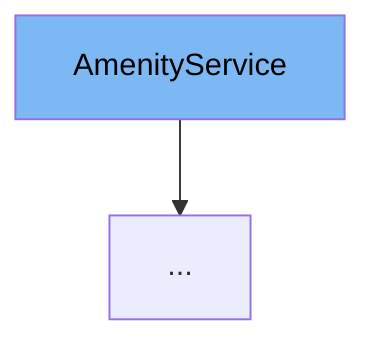

This document will cover the `AmenityService` class. We will cover:

1. What the `AmenityService` class is.
2. `AmenityService` class main variables and functions.
3. Example of how to use the `AmenityService` class.



# What is AmenityService

`AmenityService` is an interface that represents a service for managing amenities in the application. It provides methods for creating, retrieving, deleting, listing, and updating amenities.

<SwmSnippet path="/service/src/main/java/com/myhome/services/AmenityService.java" line="27">

---

# Variables and functions

The function `createAmenities` is used to create a list of amenities for a specific community. It takes a set of `AmenityDto` objects and a `communityId` as parameters and returns an optional list of `AmenityDto` objects.

```java
  Optional<List<AmenityDto>> createAmenities(Set<AmenityDto> amenities, String communityId);
```

---

</SwmSnippet>

<SwmSnippet path="/service/src/main/java/com/myhome/services/AmenityService.java" line="29">

---

The function `getAmenityDetails` is used to retrieve the details of a specific amenity. It takes an `amenityId` as a parameter and returns an optional `Amenity` object.

```java
  Optional<Amenity> getAmenityDetails(String amenityId);
```

---

</SwmSnippet>

<SwmSnippet path="/service/src/main/java/com/myhome/services/AmenityService.java" line="31">

---

The function `deleteAmenity` is used to delete a specific amenity. It takes an `amenityId` as a parameter and returns a boolean indicating whether the deletion was successful.

```java
  boolean deleteAmenity(String amenityId);
```

---

</SwmSnippet>

<SwmSnippet path="/service/src/main/java/com/myhome/services/AmenityService.java" line="33">

---

The function `listAllAmenities` is used to list all amenities for a specific community. It takes a `communityId` as a parameter and returns a set of `Amenity` objects.

```java
  Set<Amenity> listAllAmenities(String communityId);
```

---

</SwmSnippet>

<SwmSnippet path="/service/src/main/java/com/myhome/services/AmenityService.java" line="35">

---

The function `updateAmenity` is used to update a specific amenity. It takes an `updatedAmenityDto` as a parameter and returns a boolean indicating whether the update was successful.

```java
  boolean updateAmenity(AmenityDto updatedAmenityDto);
```

---

</SwmSnippet>

# Usage example

`AmenityService` is implemented by `AmenitySDJpaService` class. This class provides the concrete implementation of the methods defined in the `AmenityService` interface.

&nbsp;

*This is an auto-generated document by Swimm AI 🌊 and has not yet been verified by a human*

<SwmMeta version="3.0.0" repo-id="Z2l0aHViJTNBJTNBQ2l0aS1NeUhvbWUlM0ElM0FnaWxhZG5hdm90" repo-name="Citi-MyHome" doc-type="class"><sup>Powered by [Swimm](/)</sup></SwmMeta>
