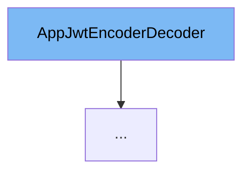

This document will cover the `AppJwtEncoderDecoder` interface in the Citi-MyHome project. We will discuss:

1. What is `AppJwtEncoderDecoder`.
2. The variables and functions defined in `AppJwtEncoderDecoder`.
3. An example of how to use `AppJwtEncoderDecoder`.



# What is AppJwtEncoderDecoder

`AppJwtEncoderDecoder` is an interface in the `com.myhome.security.jwt` package. It provides a contract for encoding and decoding JWT (JSON Web Tokens) used in the application. Implementations of this interface should provide the logic for these operations.

# Variables and functions

`AppJwtEncoderDecoder` does not have any variables as it is an interface. However, it defines two methods: `decode` and `encode`.

<SwmSnippet path="/service/src/main/java/com/myhome/security/jwt/AppJwtEncoderDecoder.java" line="23">

---

## The `decode` function

The `decode` function takes an encoded JWT and a secret as parameters. It returns an `AppJwt` object which represents the decoded JWT.

```java
  AppJwt decode(String encodedJwt, String secret);
```

---

</SwmSnippet>

<SwmSnippet path="/service/src/main/java/com/myhome/security/jwt/AppJwtEncoderDecoder.java" line="25">

---

## The `encode` function

The `encode` function takes an `AppJwt` object and a secret as parameters. It returns a string which is the encoded JWT.

```java
  String encode(AppJwt jwt, String secret);
```

---

</SwmSnippet>

<SwmSnippet path="/service/src/main/java/com/myhome/security/jwt/impl/NoSecretJwtEncoderDecoder.java" line="30">

---

# Usage example

`NoSecretJwtEncoderDecoder` is an example of a class that implements the `AppJwtEncoderDecoder` interface. It provides the logic for encoding and decoding JWTs without using a secret.

```java
public class NoSecretJwtEncoderDecoder implements AppJwtEncoderDecoder {
```

---

</SwmSnippet>

&nbsp;

*This is an auto-generated document by Swimm AI 🌊 and has not yet been verified by a human*

<SwmMeta version="3.0.0" repo-id="Z2l0aHViJTNBJTNBQ2l0aS1NeUhvbWUlM0ElM0FnaWxhZG5hdm90" repo-name="Citi-MyHome" doc-type="general-class"><sup>Powered by [Swimm](/)</sup></SwmMeta>
