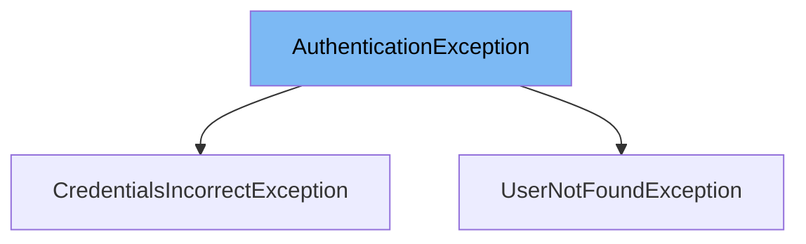

This document will cover the `AuthenticationException` class. We'll cover:

1. What is `AuthenticationException`
2. Variables and functions in `AuthenticationException`
3. Usage example of `AuthenticationException`



# What is AuthenticationException

`AuthenticationException` is a custom exception class in the Citi-MyHome project. It extends `RuntimeException` and is thrown when there are authentication errors, such as incorrect credentials or non-existent users.

<SwmSnippet path="/service/src/main/java/com/myhome/controllers/exceptions/AuthenticationException.java" line="10">

---

# Variables and functions

The constant `ERROR_MESSAGE` is used to store the error message that will be displayed when the exception is thrown. It is a static final string with the value 'Credentials are incorrect or user does not exists'.

```java
  private static final String ERROR_MESSAGE = "Credentials are incorrect or user does not exists";
```

---

</SwmSnippet>

<SwmSnippet path="/service/src/main/java/com/myhome/controllers/exceptions/AuthenticationException.java" line="11">

---

The `AuthenticationException` constructor is a no-argument constructor that calls the superclass constructor with the `ERROR_MESSAGE` as the argument.

```java
  public AuthenticationException() {
    super(ERROR_MESSAGE);
  }
```

---

</SwmSnippet>

<SwmSnippet path="/service/src/main/java/com/myhome/controllers/exceptions/UserNotFoundException.java" line="6">

---

# Usage example

`UserNotFoundException` class extends `AuthenticationException`. This means that when a user is not found, an `AuthenticationException` is thrown with the `ERROR_MESSAGE` defined in `AuthenticationException`.

```java
public class UserNotFoundException extends AuthenticationException {
  public UserNotFoundException(String userEmail) {
```

---

</SwmSnippet>

&nbsp;

*This is an auto-generated document by Swimm AI 🌊 and has not yet been verified by a human*

<SwmMeta version="3.0.0" repo-id="Z2l0aHViJTNBJTNBQ2l0aS1NeUhvbWUlM0ElM0FnaWxhZG5hdm90" repo-name="Citi-MyHome" doc-type="class"><sup>Powered by [Swimm](/)</sup></SwmMeta>
