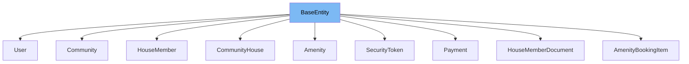

This document will cover the following aspects of the `BaseEntity` class:

1. What is `BaseEntity`.
2. Variables and functions in `BaseEntity`.
3. Usage example of `BaseEntity`.



# What is BaseEntity

`BaseEntity` is a base class for all JPA Entities in the project. It is designed to encapsulate common properties and behaviors that are shared among all entities. It is advised not to expose the id value outside of the service.

<SwmSnippet path="/service/src/main/java/com/myhome/domain/BaseEntity.java" line="38">

---

# Variables and functions

`id` is a private variable of type `Long`. It is the unique identifier for each instance of a class that extends `BaseEntity`. It is annotated with `@Id` and `@GeneratedValue` to indicate that this field is the primary key and its value is automatically generated by the database.

```java
  @Id
  @GeneratedValue(strategy = GenerationType.IDENTITY)
  private Long id;
```

---

</SwmSnippet>

<SwmSnippet path="/service/src/main/java/com/myhome/domain/CommunityHouse.java" line="56">

---

# Usage example

`CommunityHouse` is an example of a class that extends `BaseEntity`. This means that `CommunityHouse` inherits the `id` field from `BaseEntity` and can be uniquely identified by this `id` in the database.

```java
public class CommunityHouse extends BaseEntity {
```

---

</SwmSnippet>

&nbsp;

*This is an auto-generated document by Swimm AI 🌊 and has not yet been verified by a human*

<SwmMeta version="3.0.0" repo-id="Z2l0aHViJTNBJTNBQ2l0aS1NeUhvbWUlM0ElM0FnaWxhZG5hdm90" repo-name="Citi-MyHome" doc-type="general-class"><sup>Powered by [Swimm](/)</sup></SwmMeta>
