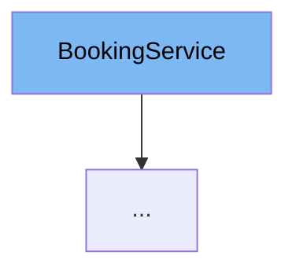

This document will cover the `BookingService` interface in the Citi-MyHome project. We'll cover:

1. What is `BookingService`
2. Variables and functions in `BookingService`
3. Usage example of `BookingService`



# What is BookingService

`BookingService` is an interface in the `com.myhome.services` package. It is used to define the contract for booking related operations in the application.

<SwmSnippet path="/service/src/main/java/com/myhome/services/BookingService.java" line="5">

---

# Variables and functions

The function `deleteBooking` is a method in the `BookingService` interface. It takes two parameters: `amenityId` and `bookingId`. The function is expected to delete a booking based on these two parameters and return a boolean indicating the success of the operation.

```java
  boolean deleteBooking(String amenityId, String bookingId);
```

---

</SwmSnippet>

# Usage example

`BookingService` is implemented in `BookingSDJpaService` class. This class provides the concrete implementation of the `deleteBooking` method defined in the `BookingService` interface.

<SwmSnippet path="/service/src/main/java/com/myhome/services/springdatajpa/BookingSDJpaService.java" line="13">

---

# Usage example

Here, `BookingSDJpaService` is implementing the `BookingService` interface. This means it provides the concrete implementation of the `deleteBooking` method.

```java
public class BookingSDJpaService implements BookingService {
```

---

</SwmSnippet>

&nbsp;

*This is an auto-generated document by Swimm AI 🌊 and has not yet been verified by a human*

<SwmMeta version="3.0.0" repo-id="Z2l0aHViJTNBJTNBQ2l0aS1NeUhvbWUlM0ElM0FnaWxhZG5hdm90" repo-name="Citi-MyHome" doc-type="class"><sup>Powered by [Swimm](/)</sup></SwmMeta>
