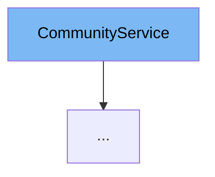

This document will cover the `CommunityService` class in the Citi-MyHome project. We will discuss:

1. What is `CommunityService`.
2. The variables and functions within `CommunityService`.
3. An example of how `CommunityService` is used in `CommunitySDJpaService`.



# What is CommunityService

`CommunityService` is an interface in the Citi-MyHome project. It provides a set of methods that are used to manage communities within the application. These methods include creating a community, listing all communities, getting community details, and managing community houses and admins.

# Variables and functions

`CommunityService` does not have any variables as it is an interface. However, it declares several methods that must be implemented by any class that implements this interface.

<SwmSnippet path="/service/src/main/java/com/myhome/services/CommunityService.java" line="29">

---

## createCommunity

The `createCommunity` function is used to create a new community. It takes a `CommunityDto` object as a parameter, which contains the details of the community to be created.

```java
  Community createCommunity(CommunityDto communityDto);
```

---

</SwmSnippet>

<SwmSnippet path="/service/src/main/java/com/myhome/services/CommunityService.java" line="31">

---

## listAll

The `listAll` function is overloaded to list all communities. One version takes no parameters and returns a set of all communities. The other version takes a `Pageable` object as a parameter, which can be used to apply pagination to the result set.

```java
  Set<Community> listAll();

  Set<Community> listAll(Pageable pageable);
```

---

</SwmSnippet>

<SwmSnippet path="/service/src/main/java/com/myhome/services/CommunityService.java" line="35">

---

## getCommunityDetailsById

The `getCommunityDetailsById` function is used to retrieve the details of a specific community by its ID. It returns an `Optional` that may contain the `Community` object if a community with the given ID exists.

```java
  Optional<Community> getCommunityDetailsById(String communityId);
```

---

</SwmSnippet>

<SwmSnippet path="/service/src/main/java/com/myhome/services/CommunityService.java" line="37">

---

## findCommunityHousesById

The `findCommunityHousesById` function is used to retrieve the houses of a specific community by the community's ID. It returns an `Optional` that may contain a list of `CommunityHouse` objects if a community with the given ID exists.

```java
  Optional<List<CommunityHouse>> findCommunityHousesById(String communityId, Pageable pageable);
```

---

</SwmSnippet>

<SwmSnippet path="/service/src/main/java/com/myhome/services/CommunityService.java" line="39">

---

## findCommunityAdminsById

The `findCommunityAdminsById` function is used to retrieve the admins of a specific community by the community's ID. It returns an `Optional` that may contain a list of `User` objects if a community with the given ID exists.

```java
  Optional<List<User>> findCommunityAdminsById(String communityId, Pageable pageable);
```

---

</SwmSnippet>

<SwmSnippet path="/service/src/main/java/com/myhome/services/CommunityService.java" line="41">

---

## findCommunityAdminById

The `findCommunityAdminById` function is used to retrieve a specific admin by the admin's ID. It returns an `Optional` that may contain the `User` object if an admin with the given ID exists.

```java
  Optional<User> findCommunityAdminById(String adminId);
```

---

</SwmSnippet>

<SwmSnippet path="/service/src/main/java/com/myhome/services/CommunityService.java" line="43">

---

## getCommunityDetailsByIdWithAdmins

The `getCommunityDetailsByIdWithAdmins` function is used to retrieve the details of a specific community along with its admins by the community's ID. It returns an `Optional` that may contain the `Community` object if a community with the given ID exists.

```java
  Optional<Community> getCommunityDetailsByIdWithAdmins(String communityId);
```

---

</SwmSnippet>

<SwmSnippet path="/service/src/main/java/com/myhome/services/CommunityService.java" line="45">

---

## addAdminsToCommunity

The `addAdminsToCommunity` function is used to add admins to a specific community. It takes the community's ID and a set of admin IDs as parameters. It returns an `Optional` that may contain the updated `Community` object if the operation was successful.

```java
  Optional<Community> addAdminsToCommunity(String communityId, Set<String> admins);
```

---

</SwmSnippet>

<SwmSnippet path="/service/src/main/java/com/myhome/services/CommunityService.java" line="47">

---

## addHousesToCommunity

The `addHousesToCommunity` function is used to add houses to a specific community. It takes the community's ID and a set of `CommunityHouse` objects as parameters. It returns a set of house IDs that were successfully added to the community.

```java
  Set<String> addHousesToCommunity(String communityId, Set<CommunityHouse> houses);
```

---

</SwmSnippet>

<SwmSnippet path="/service/src/main/java/com/myhome/services/CommunityService.java" line="49">

---

## removeHouseFromCommunityByHouseId

The `removeHouseFromCommunityByHouseId` function is used to remove a house from a community. It takes a `Community` object and a house ID as parameters. It returns a boolean indicating whether the operation was successful.

```java
  boolean removeHouseFromCommunityByHouseId(Community community, String houseId);
```

---

</SwmSnippet>

<SwmSnippet path="/service/src/main/java/com/myhome/services/CommunityService.java" line="51">

---

## deleteCommunity

The `deleteCommunity` function is used to delete a community. It takes the community's ID as a parameter and returns a boolean indicating whether the operation was successful.

```java
  boolean deleteCommunity(String communityId);
```

---

</SwmSnippet>

<SwmSnippet path="/service/src/main/java/com/myhome/services/CommunityService.java" line="53">

---

## removeAdminFromCommunity

The `removeAdminFromCommunity` function is used to remove an admin from a community. It takes the community's ID and the admin's ID as parameters and returns a boolean indicating whether the operation was successful.

```java
  boolean removeAdminFromCommunity(String communityId, String adminId);
```

---

</SwmSnippet>

<SwmSnippet path="/service/src/main/java/com/myhome/services/springdatajpa/CommunitySDJpaService.java" line="28">

---

# Usage example

`CommunitySDJpaService` is an example of a class that implements the `CommunityService` interface. It provides concrete implementations for all the methods declared in `CommunityService`.

```java
import com.myhome.services.CommunityService;
import com.myhome.services.HouseService;
import java.util.HashSet;
import java.util.List;
import java.util.Optional;
import java.util.Set;
import java.util.UUID;
import java.util.stream.Collectors;
import javax.transaction.Transactional;
import lombok.RequiredArgsConstructor;
import lombok.extern.slf4j.Slf4j;
import org.springframework.data.domain.Pageable;
import org.springframework.security.core.context.SecurityContextHolder;
import org.springframework.stereotype.Service;

@Slf4j
@RequiredArgsConstructor
@Service
public class CommunitySDJpaService implements CommunityService {
  private final CommunityRepository communityRepository;
  private final UserRepository communityAdminRepository;
```

---

</SwmSnippet>

&nbsp;

*This is an auto-generated document by Swimm AI 🌊 and has not yet been verified by a human*

<SwmMeta version="3.0.0" repo-id="Z2l0aHViJTNBJTNBQ2l0aS1NeUhvbWUlM0ElM0FnaWxhZG5hdm90" repo-name="Citi-MyHome" doc-type="class"><sup>Powered by [Swimm](/)</sup></SwmMeta>
