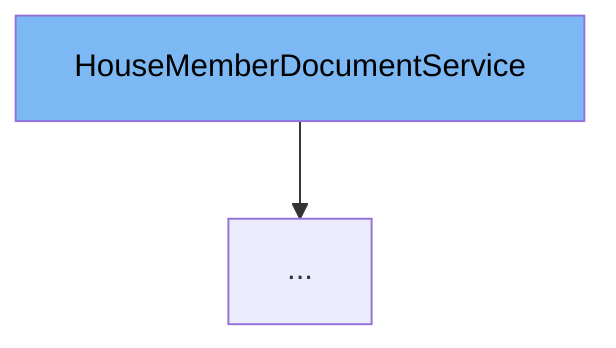

This document will cover the `HouseMemberDocumentService` class. We'll cover:

1. What is `HouseMemberDocumentService`
2. Variables and functions in `HouseMemberDocumentService`
3. Usage example of `HouseMemberDocumentService`



# What is HouseMemberDocumentService

`HouseMemberDocumentService` is an interface in the Citi-MyHome project that defines the contract for the service layer responsible for handling operations related to `HouseMemberDocument`. It provides methods for creating, updating, finding, and deleting `HouseMemberDocument` instances.

<SwmSnippet path="/service/src/main/java/com/myhome/services/HouseMemberDocumentService.java" line="25">

---

# Variables and functions

The function `deleteHouseMemberDocument` is used to delete a `HouseMemberDocument` associated with a given member ID. It returns a boolean indicating the success of the operation.

```java
  boolean deleteHouseMemberDocument(String memberId);
```

---

</SwmSnippet>

<SwmSnippet path="/service/src/main/java/com/myhome/services/HouseMemberDocumentService.java" line="27">

---

The function `findHouseMemberDocument` is used to find a `HouseMemberDocument` associated with a given member ID. It returns an `Optional<HouseMemberDocument>` which will contain the `HouseMemberDocument` if it exists.

```java
  Optional<HouseMemberDocument> findHouseMemberDocument(String memberId);
```

---

</SwmSnippet>

<SwmSnippet path="/service/src/main/java/com/myhome/services/HouseMemberDocumentService.java" line="29">

---

The function `updateHouseMemberDocument` is used to update a `HouseMemberDocument` associated with a given member ID. It takes a `MultipartFile` and a member ID as parameters and returns an `Optional<HouseMemberDocument>` which will contain the updated `HouseMemberDocument` if the operation was successful.

```java
  Optional<HouseMemberDocument> updateHouseMemberDocument(MultipartFile multipartFile,
      String memberId);
```

---

</SwmSnippet>

<SwmSnippet path="/service/src/main/java/com/myhome/services/HouseMemberDocumentService.java" line="32">

---

The function `createHouseMemberDocument` is used to create a new `HouseMemberDocument` associated with a given member ID. It takes a `MultipartFile` and a member ID as parameters and returns an `Optional<HouseMemberDocument>` which will contain the created `HouseMemberDocument` if the operation was successful.

```java
  Optional<HouseMemberDocument> createHouseMemberDocument(MultipartFile multipartFile,
      String memberId);
```

---

</SwmSnippet>

<SwmSnippet path="/service/src/main/java/com/myhome/services/springdatajpa/HouseMemberDocumentSDJpaService.java" line="40">

---

# Usage example

`HouseMemberDocumentSDJpaService` is an example of a class that implements `HouseMemberDocumentService`. It provides concrete implementations for the methods defined in the `HouseMemberDocumentService` interface.

```java
public class HouseMemberDocumentSDJpaService implements HouseMemberDocumentService {
```

---

</SwmSnippet>

&nbsp;

*This is an auto-generated document by Swimm AI 🌊 and has not yet been verified by a human*

<SwmMeta version="3.0.0" repo-id="Z2l0aHViJTNBJTNBQ2l0aS1NeUhvbWUlM0ElM0FnaWxhZG5hdm90" repo-name="Citi-MyHome" doc-type="class"><sup>Powered by [Swimm](/)</sup></SwmMeta>
