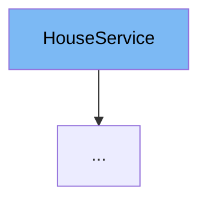

This document will cover the `HouseService` class. We'll cover:

1. What is `HouseService`.
2. `HouseService`'s variables and functions.
3. An example of how to use `HouseService`.



# What is HouseService

`HouseService` is an interface in the Citi-MyHome project that provides a set of methods for managing houses and house members within a community. It is used to list all houses, add members to a house, delete members from a house, get house details by ID, get house members by ID, and list house members for houses of a specific user.

<SwmSnippet path="/service/src/main/java/com/myhome/services/HouseService.java" line="27">

---

# Variables and functions

The function `listAllHouses` is used to retrieve a set of all `CommunityHouse` instances.

```java
  Set<CommunityHouse> listAllHouses();

```

---

</SwmSnippet>

<SwmSnippet path="/service/src/main/java/com/myhome/services/HouseService.java" line="29">

---

The function `listAllHouses` is an overloaded version of the previous function, allowing pagination through the `Pageable` parameter.

```java
  Set<CommunityHouse> listAllHouses(Pageable pageable);

```

---

</SwmSnippet>

<SwmSnippet path="/service/src/main/java/com/myhome/services/HouseService.java" line="31">

---

The function `addHouseMembers` is used to add a set of `HouseMember` instances to a house identified by `houseId`.

```java
  Set<HouseMember> addHouseMembers(String houseId, Set<HouseMember> houseMembers);

```

---

</SwmSnippet>

<SwmSnippet path="/service/src/main/java/com/myhome/services/HouseService.java" line="33">

---

The function `deleteMemberFromHouse` is used to remove a `HouseMember` identified by `memberId` from a house identified by `houseId`.

```java
  boolean deleteMemberFromHouse(String houseId, String memberId);

```

---

</SwmSnippet>

<SwmSnippet path="/service/src/main/java/com/myhome/services/HouseService.java" line="35">

---

The function `getHouseDetailsById` is used to retrieve the details of a `CommunityHouse` identified by `houseId`.

```java
  Optional<CommunityHouse> getHouseDetailsById(String houseId);

```

---

</SwmSnippet>

<SwmSnippet path="/service/src/main/java/com/myhome/services/HouseService.java" line="37">

---

The function `getHouseMembersById` is used to retrieve a list of `HouseMember` instances for a house identified by `houseId`, with pagination support through the `Pageable` parameter.

```java
  Optional<List<HouseMember>> getHouseMembersById(String houseId, Pageable pageable);

```

---

</SwmSnippet>

<SwmSnippet path="/service/src/main/java/com/myhome/services/HouseService.java" line="39">

---

The function `listHouseMembersForHousesOfUserId` is used to retrieve a list of `HouseMember` instances for houses owned by a user identified by `userId`, with pagination support through the `Pageable` parameter.

```java
  Optional<List<HouseMember>> listHouseMembersForHousesOfUserId(String userId, Pageable pageable);
}
```

---

</SwmSnippet>

<SwmSnippet path="/service/src/main/java/com/myhome/services/springdatajpa/HouseSDJpaService.java" line="37">

---

# Usage example

`HouseSDJpaService` is an example of a class that implements the `HouseService` interface. It provides concrete implementations for all the methods defined in `HouseService`.

```java
public class HouseSDJpaService implements HouseService {
  private final HouseMemberRepository houseMemberRepository;
```

---

</SwmSnippet>

&nbsp;

*This is an auto-generated document by Swimm AI 🌊 and has not yet been verified by a human*

<SwmMeta version="3.0.0" repo-id="Z2l0aHViJTNBJTNBQ2l0aS1NeUhvbWUlM0ElM0FnaWxhZG5hdm90" repo-name="Citi-MyHome" doc-type="class"><sup>Powered by [Swimm](/)</sup></SwmMeta>
