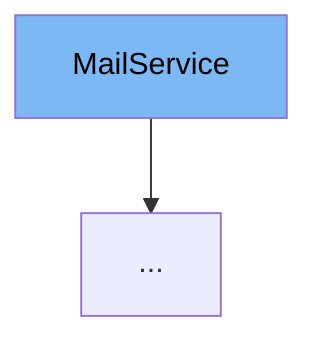

This document will cover the `MailService` interface in the Citi-MyHome project. We'll cover:

1. What is `MailService`.
2. The variables and functions defined in `MailService`.
3. An example of how to use `MailService` in `DevMailSDJpaService`.



# What is MailService

`MailService` is an interface in the Citi-MyHome project that defines methods for sending different types of emails to users. These emails include password recovery codes, account creation confirmations, password change notifications, and account confirmation messages.

# Variables and functions

`MailService` does not contain any variables as it is an interface. However, it defines several methods that must be implemented by any class that implements this interface.

<SwmSnippet path="/service/src/main/java/com/myhome/services/MailService.java" line="8">

---

## sendPasswordRecoverCode

The `sendPasswordRecoverCode` method is used to send a password recovery code to a user. It takes a `User` object and a `randomCode` string as parameters and returns a boolean indicating the success of the operation.

```java
  boolean sendPasswordRecoverCode(User user, String randomCode);
```

---

</SwmSnippet>

<SwmSnippet path="/service/src/main/java/com/myhome/services/MailService.java" line="10">

---

## sendAccountCreated

The `sendAccountCreated` method is used to send an account creation confirmation to a user. It takes a `User` object and a `SecurityToken` object as parameters and returns a boolean indicating the success of the operation.

```java
  boolean sendAccountCreated(User user, SecurityToken emailConfirmToken);
```

---

</SwmSnippet>

<SwmSnippet path="/service/src/main/java/com/myhome/services/MailService.java" line="12">

---

## sendPasswordSuccessfullyChanged

The `sendPasswordSuccessfullyChanged` method is used to send a password change notification to a user. It takes a `User` object as a parameter and returns a boolean indicating the success of the operation.

```java
  boolean sendPasswordSuccessfullyChanged(User user);
```

---

</SwmSnippet>

<SwmSnippet path="/service/src/main/java/com/myhome/services/MailService.java" line="14">

---

## sendAccountConfirmed

The `sendAccountConfirmed` method is used to send an account confirmation message to a user. It takes a `User` object as a parameter and returns a boolean indicating the success of the operation.

```java
  boolean sendAccountConfirmed(User user);
```

---

</SwmSnippet>

<SwmSnippet path="/service/src/main/java/com/myhome/services/springdatajpa/DevMailSDJpaService.java" line="14">

---

# Usage example

`DevMailSDJpaService` is an example of a class that implements the `MailService` interface. It provides implementations for all the methods defined in `MailService`.

```java
public class DevMailSDJpaService implements MailService {
```

---

</SwmSnippet>

&nbsp;

*This is an auto-generated document by Swimm AI 🌊 and has not yet been verified by a human*

<SwmMeta version="3.0.0" repo-id="Z2l0aHViJTNBJTNBQ2l0aS1NeUhvbWUlM0ElM0FnaWxhZG5hdm90" repo-name="Citi-MyHome" doc-type="class"><sup>Powered by [Swimm](/)</sup></SwmMeta>
