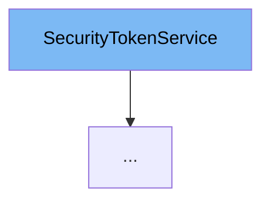

This document will cover the `SecurityTokenService` interface. We'll cover:

1. What is `SecurityTokenService`.
2. Variables and functions in `SecurityTokenService`.
3. Usage example of `SecurityTokenService`.



# What is SecurityTokenService

`SecurityTokenService` is an interface in the `com.myhome.services` package. It's designed to manage security tokens within the application, specifically for email confirmation and password reset functionalities.

# Variables and functions

`SecurityTokenService` does not contain any variables as it is an interface. However, it declares three important methods related to security token management.

<SwmSnippet path="/service/src/main/java/com/myhome/services/SecurityTokenService.java" line="8">

---

## createEmailConfirmToken

The `createEmailConfirmToken` method is used to create a new email confirmation token for a given user. It takes a `User` object as a parameter and returns a `SecurityToken`.

```java
  SecurityToken createEmailConfirmToken(User owner);
```

---

</SwmSnippet>

<SwmSnippet path="/service/src/main/java/com/myhome/services/SecurityTokenService.java" line="10">

---

## createPasswordResetToken

The `createPasswordResetToken` method is used to create a new password reset token for a given user. Similar to `createEmailConfirmToken`, it takes a `User` object as a parameter and returns a `SecurityToken`.

```java
  SecurityToken createPasswordResetToken(User owner);
```

---

</SwmSnippet>

<SwmSnippet path="/service/src/main/java/com/myhome/services/SecurityTokenService.java" line="12">

---

## useToken

The `useToken` method is used to consume a `SecurityToken`. It takes a `SecurityToken` as a parameter and returns a `SecurityToken` after performing necessary operations.

```java
  SecurityToken useToken(SecurityToken token);
```

---

</SwmSnippet>

# Usage example

`SecurityTokenService` is implemented in `SecurityTokenSDJpaService` class. It provides the concrete implementation of the methods declared in `SecurityTokenService`.

<SwmSnippet path="/service/src/main/java/com/myhome/services/springdatajpa/SecurityTokenSDJpaService.java" line="18">

---

# Usage example

Here, `SecurityTokenSDJpaService` class implements `SecurityTokenService` interface, providing the actual implementation of the methods.

```java
public class SecurityTokenSDJpaService implements SecurityTokenService {
```

---

</SwmSnippet>

&nbsp;

*This is an auto-generated document by Swimm AI 🌊 and has not yet been verified by a human*

<SwmMeta version="3.0.0" repo-id="Z2l0aHViJTNBJTNBQ2l0aS1NeUhvbWUlM0ElM0FnaWxhZG5hdm90" repo-name="Citi-MyHome" doc-type="class"><sup>Powered by [Swimm](/)</sup></SwmMeta>
